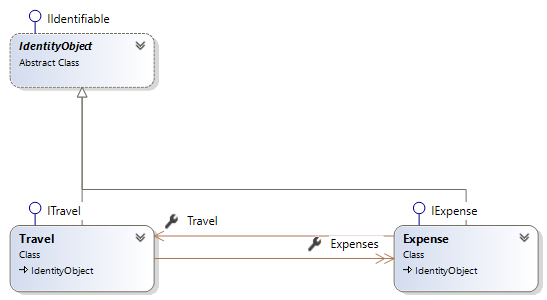
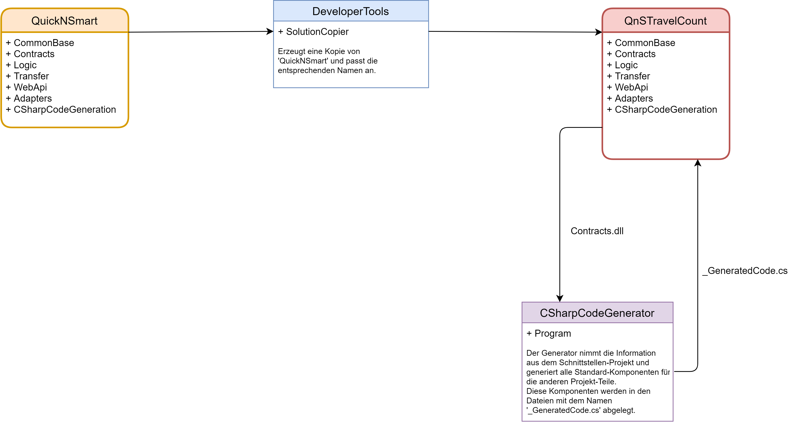

# QnSTravelCount

Das Projekt 'QnSTravelCount' ist ein kleines datenzentriertes Anwendungsbeispiel mit welchem die Erstellung eines Software-Systems dargestellt werden soll. Dieses System wird mithilfe des '[QuickNSmart](https://github.com/leoggehrer/QuickNSmart)'-Framework erstellt. 

## Projekt

Zur Umsetzung des Projektes wird DotNetCore (3.1) als Framework, die Programmiersprache CSharp (C#) und die Entwicklungsumgebung Visual Studio 2019 Community verwendet. Alle Komponenten können kostenlos aus dem Internet heruntergeladen werden.

### Datenstruktur

Die Datenstruktur vom 'QnSTravelCount' ist überschaulich und besteht im wesentlichen aus 2 Komponenten welche in der folgenden Tabelle zusammengefasst sind:

|Komponente|Beschreibung|Grösse|Mussfeld|Eindeutig|
|---|---|---|---|---|
|**Travel**|Eine Reise ist die Zusammenfassung aller Kosten die auf dieser Reise entstanden sind.|
|*Designation*|Bezeichnung der Reise|256|Ja|Ja|
|*Description*|Bezeichnung der Reise|256|Nein|Nein|
|*Currency*|Bezeichnung der Währung|10|Ja|Nein|
|*Friends*|Angabe der Teilnehmer (Freunde) durch Semicolon getrennt|1024|Ja|Ja|
|*Category*|Kategorie (Bildungsreise, Urlaub,..) der Reise|64|Nein|Nein|
|**Expense**|Eine Kostenposition für eine Reise.|||
|*TravelId*|Fremdschüssel zur rise (Travel)|int|Ja|Nein|
|*Date*|Datum der Zahlung|DataTime|Ja|Nein|
|*Description*|Beschreibung der Kosten (Essen, Eintritt...)|128|Ja|Nein|
|*Friend*|Bezahlt vom Teilnehmer (Friend)|25|Ja|Nein|
|**Hinweis**|Alle Komponenten haben eine eindeutige Identität (Id)||||
|*|*Natürlich können noch weitere Attribute hinzugefügt werden.*||||

Aus dieser Definition kann ein entsprechendes Objektmodell abgeleitet werden, welches nachfolgend skizziert ist:



Wie aus der Abbildung leicht erkennbar ist, sind für alle Entitäten Schnittstellen definiert. Diese Schnittstellen sind im Projekt 
'QnSTravelCount.Contracts' im Ordner 'Persistence/App' definiert und dienen zur Interaktion mit den Entitätsobjekten außerhalb der Bibliothek. Das Model zeigt auch noch eine Basisklasse mit dem Namen 'IdentityObject'. Diese Klasse ist die Basisklasse für alle Entitäten im System und definiert die Identität der Objekte und beinhaltet die Eigenschaft, mit welcher die Identität eines Entitätstyp eindeutig bestimmt wird. Im Moment besteht diese Eigenschaft aus einer Id mit dem Datentyp Integer und wird vom System automatisch vergeben.  

## System-Erstellungs-Prozess

### Übersicht  



Als Ausgangsbasis wird der Framework 'QuickNSmart' verwendet. Diese Projekt wird mit Hilfe dem Hilfsprogramm 'SolutionCopier' in ein Verzeichnis nach eigener Wahl kopiert. In diesem Verzeichnis werden alle Projektteile vom Framework kopiert und die Namen der Projekte werden entsprechend angepasst. Alle Projekte mit einem domainspezifischen Namen werden durch den Namen des Verzeichnisses ersetzt.  

In diesem Beispiel wird ein Projekt mit dem Namen 'QnSTravelCount' erstellt werden:

````csharp
string sourcePath = @"...\QnSTravelCount";
string targetPath = @"...\QnSTravelCount";

var sc = new SolutionCopier();

sc.Copy(sourcePath, targetPath);
````

Nach dem Ausführen vom SolutionCopier (*sc.Copy(sourcePath, targetPath)*) befindet sich folgende Verzeichnisstruktur in **QnSTravelCount**:  

- CommonBase
- CSharpCodeGenerator.ConApp
- QnSTravelCount.Contracts
- QnSTravelCount.Logic
- QnSTravelCount.Transfer
- QnSTravelCount.WebApi
- QnSTravelCount.Adapters
- QnSTravelCount.ConApp

Im Projekt 'QnSTravelCount' sind alle Code-Teile, welche mit den Namensraum 'QuickNSmart' verbunden sind mit dem neuen Projekt-Namen 'QnSTravelCont' ersetzt worden.  

### Anpassen des Projektes  

Nun sind alle Projekt-Teile erstellt und im Projekt 'QnSTravelCount.Contracts' können die entsprechenden Schnittstellen definiert werden. Als Modul für die Schnittstellen wird der Name 'App' verwendet. Das hat den Vorteil, dass die Tabellen in diesem Bereich mit dem Datenbankschema 'App.XYZ' erstellt werden. Nachfolgend die Definition der Schnittstellen ITravel und IExpense:

```csharp ({"Type": "FileRef", "File": "Contracts/Persistence/App/ITravel.cs", "StartTag": "//MdStart", "EndTag": "//MdEnd" })
namespace QnSTravelCount.Contracts.Persistence.App
{
    public partial interface ITravel : IIdentifiable, ICopyable<ITravel>
    {
        string Designation { get; set; }
        string Description { get; set; }
        string Currency { get; set; }
        string Friends { get; set; }
        string Category { get; set; }
    }
}
``` 

```csharp ({"Type": "FileRef", "File": "Contracts/Persistence/App/IExpense.cs", "StartTag": "//MdStart", "EndTag": "//MdEnd" })
using System;

namespace QnSTravelCount.Contracts.Persistence.App
{
    public partial interface IExpense : IIdentifiable, ICopyable<IExpense>
    {
        int TravelId { get; set; }
        DateTime Date { get; }
        string Description { get; set; }
        double Amount { get; set; }
        string Friend { get; set; }
    }
}
``` 

Wenn nach der Definition der Schnittstellen die Anwendung erstellt wird, erkennt das System die Änderung und aktiviert automatisch den Code-Generator. Das bedeutet, dass alle Komponenten neu generiert werden und in die Dateien '_GeneratedCode.cs' abgelegt sind. Der Code-Generator erzeugt alle Komponenten als 'partial'-Klassen. Damit hat man eine flexible Möglichkeit den generierten Code anzupassen.  

#### Anpassen der Datenbank  

Der Code-Generator erzeugt den 'QnSTravelCountDbContext' und legt dabei das Datenbankschema, den Tabellennamen, den Key (Schlüsselspalte Id) und den 'Timestamp (RowVersion) fest. Allerdings kann der Code-Generator nicht die Spaltengrößen, ob die Spalte Nullwerte erlaubt oder nicht usw., festlegen. Für diesen Zweck generiert der Code-Generator die folgenden 'partial'-Methoden:

```csharp
partial void ConfigureEntityType(EntityTypeBuilder<Entities.Persistence.App.Expense> entityTypeBuilder);
partial void ConfigureEntityType(EntityTypeBuilder<Entities.Persistence.App.Travel> entityTypeBuilder);
```

Der Programmierer kann nun diese Methoden in einer 'partial'-Methode definieren und die fehlenden Eigenschaften festlegen. Nachfolgend befinden sich die erweiterten Definitionen für das Projekt 'QnSTravelCount':

```csharp ({"Type": "FileRef", "File": "Logic/DataContext/Db/QnSTravelCountDbContext.cs", "StartTag": "//MdStartConfig", "EndTag": "//MdEndConfig" })
        partial void ConfigureEntityType(EntityTypeBuilder<Travel> entityTypeBuilder)
        {
            entityTypeBuilder
                .HasIndex(p => p.Designation)
                .IsUnique();
            entityTypeBuilder
                .Property(p => p.Designation)
                .IsRequired()
                .HasMaxLength(256);
            entityTypeBuilder
                .Property(p => p.Description)
                .HasMaxLength(256);
            entityTypeBuilder
                .Property(p => p.Currency)
                .IsRequired()
                .HasMaxLength(10);
            entityTypeBuilder
                .Property(p => p.Friends)
                .IsRequired()
                .HasMaxLength(1024);
            entityTypeBuilder
                .Property(p => p.Category)
                .IsRequired()
                .HasMaxLength(64);
        }
        partial void ConfigureEntityType(EntityTypeBuilder<Expense> entityTypeBuilder)
        {
            entityTypeBuilder
                .Property(p => p.Description)
                .IsRequired()
                .HasMaxLength(128);
            entityTypeBuilder
                .Property(p => p.Friend)
                .IsRequired()
                .HasMaxLength(25);
        }
``` 

#### Erstellen der Datenbank  

Nun sind alle Vorbereitungen getroffen und die Datenbank kann erstellt werden. Das Erstellen der Datenbank kann nach der Installations-Anleitung, welche dem Projekt beigefügt ist, durchgeführt werden.  

Wenn nun die Datenbank fehlerfrei erzeugt wurde, können bereits Reisen mit dem zugehörigen Kosten erstellt werden. Dabei ist es unerheblich, ob dies direkt - als über die Logik - oder über die Rest-Schnittstelle erfolgt.  

**Viel Spaß beim Testen!**
